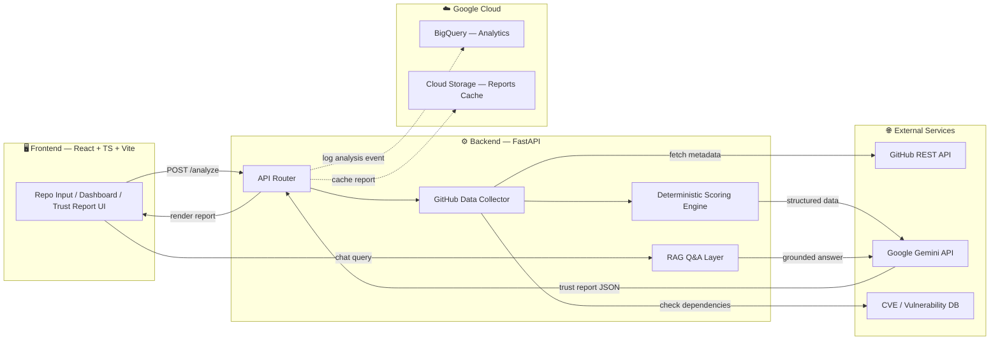
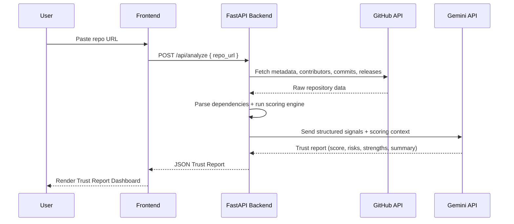

<div align="center">

# 🛡️ TrustGraph

### AI-Powered Repository Trust Analyzer

*Know before you `npm install`.*

[](https://opensource.org/licenses/MIT)
[](https://fastapi.tiangolo.com/)
[](https://react.dev/)
[](https://www.typescriptlang.org/)
[](https://ai.google.dev/)
[](https://cloud.google.com/)
[](CONTRIBUTING.md)
[](#)

**[Live Demo](#-demo)** · **[Report Bug](../../issues)** · **[Request Feature](../../issues)**

</div>

> 💡 **Naming note:** We renamed the project from `Gen-AI-Hackathon` to **TrustGraph** — it better reflects what the product actually does (mapping the "trust graph" of a repo: maintainers, dependencies, activity, and risk) and reads better as a standalone product name outside the hackathon context. Feel free to rename back if your team prefers consistency with your submission portal.

---

## 📖 Table of Contents

- [Problem Statement](#-problem-statement)
- [Our Solution](#-our-solution)
- [Features](#-features)
- [Architecture](#-architecture)
- [Tech Stack](#-tech-stack)
- [Folder Structure](#-folder-structure)
- [Installation Guide](#-installation-guide)
- [Running the Project](#-running-the-project)
- [API Workflow](#-api-workflow)
- [Team & Module Responsibilities](#-team--module-responsibilities)
- [Future Scope](#-future-scope)
- [Screenshots](#-screenshots)
- [Demo](#-demo)
- [License](#-license)
- [Contributors](#-contributors)

---

## 🎯 Problem Statement

Every day, developers pull in open-source dependencies without a reliable way to answer a simple question:

> **"Can I actually trust this repository?"**

Stars and forks are vanity metrics that are easy to game and don't reflect:
- 🔓 Whether the project has unpatched security vulnerabilities
- 🧑‍🤝‍🧑 Whether it depends on a single maintainer who could disappear tomorrow (bus factor)
- 🕰️ Whether it's actively maintained or quietly abandoned
- 📄 Whether documentation and licensing are actually usable in production
- 🔗 Whether its own dependency tree is healthy

Manually auditing a repository takes 30–60 minutes of digging through commits, issues, and README files — and most developers skip this step entirely, leading to **supply-chain risk, dead dependencies, and production incidents.**

## 💡 Our Solution

**TrustGraph** automates repository due-diligence. Paste a GitHub URL, and within seconds you get an **AI-generated Trust Report** that combines:

1. **Deterministic signals** — pulled directly from the GitHub REST API (commits, contributors, releases, issues, license, dependency manifests)
2. **A rule-based scoring engine** — objective, reproducible scores that don't hallucinate
3. **Gemini-powered reasoning** — a natural-language summary, risk narrative, and final recommendation grounded in the deterministic data above

The result: a **Trust Score**, a clear **Safe / Caution / High Risk** verdict, and the reasoning behind it — in the time it takes to read a tweet.

---

## ✨ Features

| Category | Feature | Description |
|---|---|---|
| 🔍 **Core Analysis** | Repository Metadata Scan | Stars, forks, contributors, languages, license, last commit |
| 🔍 **Core Analysis** | README & Docs Quality Check | Evaluates completeness of documentation |
| 🔍 **Core Analysis** | Dependency Extraction | Parses `package.json`, `requirements.txt`, `go.mod`, etc. |
| 🧠 **AI Layer** | Gemini Trust Report | Structured JSON report: score, risks, strengths, summary |
| 🧠 **AI Layer** | Final Recommendation | ✅ Safe to Use / ⚠️ Use with Caution / ❌ High Risk |
| 👥 **Bus-Factor Analysis** | Maintainer Concentration | Flags projects reliant on 1–2 contributors |
| 🛡️ **Security** | CVE Scanning | Cross-references dependencies against known vulnerability databases |
| ⚖️ **Compare Mode** | Side-by-Side Analysis | Compare two repos before choosing a dependency |
| 💬 **RAG Chat Layer** | Ask-the-Repo Assistant | Grounded Q&A chat over the analyzed repo's data |
| 📊 **Reporting** | Shareable Trust Reports | Exportable, linkable report pages |

---

## 🏗️ Architecture



**Flow summary:** the frontend sends a repo URL → FastAPI collects raw signals from GitHub (and a CVE feed) → a deterministic scoring engine computes objective sub-scores → Gemini receives the structured data (not raw guesswork) and produces the narrative trust report → the result is rendered back to the user and optionally logged to BigQuery for analytics.

---

## 🧰 Tech Stack

<table>
<tr>
<td valign="top" width="25%">

**Frontend**
- React
- TypeScript
- Tailwind CSS
- Vite

</td>
<td valign="top" width="25%">

**Backend**
- FastAPI
- Python 3.11+

</td>
<td valign="top" width="25%">

**AI / Data**
- Google Gemini API
- GitHub REST API

</td>
<td valign="top" width="25%">

**Cloud / Deploy**
- Google Cloud (BigQuery)
- Vercel (frontend)
- Render (backend)

</td>
</tr>
</table>

---

## 📁 Folder Structure

```
trustgraph/
├── frontend/                      # React + TS + Vite app
│   ├── src/
│   │   ├── components/            # UI components (ReportCard, ScoreGauge, ChatBox...)
│   │   ├── pages/                 # Home, Report, Compare
│   │   ├── hooks/                 # useAnalyzeRepo, useTrustReport
│   │   ├── lib/                   # API client, formatters
│   │   ├── types/                 # Shared TS interfaces
│   │   └── App.tsx
│   ├── tailwind.config.ts
│   └── vite.config.ts
│
├── backend/                       # FastAPI service
│   ├── app/
│   │   ├── api/routes/            # /analyze, /compare, /chat endpoints
│   │   ├── services/
│   │   │   ├── github_collector.py    # GitHub API integration
│   │   │   ├── dependency_parser.py   # package.json / requirements.txt parsing
│   │   │   ├── cve_scanner.py         # Vulnerability lookups
│   │   │   ├── scoring_engine.py      # Deterministic trust scoring
│   │   │   └── gemini_client.py       # Prompting + Gemini integration
│   │   ├── models/                # Pydantic schemas
│   │   ├── core/                  # Config, settings, logging
│   │   └── main.py
│   ├── requirements.txt
│   └── Dockerfile
│
├── docs/
│   ├── architecture.md
│   └── screenshots/
│
├── .env.example
├── LICENSE
└── README.md
```

---

## ⚙️ Installation Guide

### Prerequisites
- Node.js ≥ 18
- Python ≥ 3.11
- A [GitHub Personal Access Token](https://github.com/settings/tokens) (for higher API rate limits)
- A [Google Gemini API key](https://ai.google.dev/)

### 1. Clone the repository
```bash
git clone https://github.com/<your-org>/trustgraph.git
cd trustgraph
```

### 2. Backend setup
```bash
cd backend
python -m venv venv
source venv/bin/activate        # Windows: venv\Scripts\activate
pip install -r requirements.txt
cp ../.env.example .env         # then fill in GITHUB_TOKEN and GEMINI_API_KEY
```

### 3. Frontend setup
```bash
cd ../frontend
npm install
cp .env.example .env.local      # set VITE_API_BASE_URL
```

---

## ▶️ Running the Project

**Backend** (from `/backend`):
```bash
uvicorn app.main:app --reload --port 8000
```

**Frontend** (from `/frontend`):
```bash
npm run dev
```

App will be available at `http://localhost:5173`, calling the API at `http://localhost:8000`.

**Docker (optional, one-shot):**
```bash
docker-compose up --build
```

---

## 🔄 API Workflow



**Key endpoints:**

| Method | Endpoint | Description |
|---|---|---|
| `POST` | `/api/analyze` | Analyze a single repository |
| `POST` | `/api/compare` | Compare two repositories side-by-side |
| `POST` | `/api/chat` | Ask a grounded question about an analyzed repo |
| `GET` | `/api/report/{id}` | Retrieve a cached trust report |

---

## 👥 Team & Module Responsibilities

| Member | Module | Responsibilities |
|---|---|---|
| _Name 1_ | Frontend | React UI, Trust Report dashboard, Compare Mode UI |
| _Name 2_ | Backend Core | FastAPI setup, GitHub data collector, dependency parser |
| _Name 3_ | AI Integration | Gemini prompt design, structured report generation, RAG chat layer |
| _Name 4_ | Data & Cloud | Scoring engine, BigQuery logging, deployment (Vercel/Render) |

> ✏️ Replace names above with your actual team roster before submission.

---

## 🚀 Future Scope

- 🔮 **Future Risk Prediction** — forecast repo health trajectory using historical activity trends
- 😖 **Repository Regret Score** — quantify likely long-term maintenance pain of adopting a dependency
- 📊 **BigQuery Analytics Dashboard** — aggregate trust trends across analyzed repos
- ⚡ **NVIDIA RAPIDS Acceleration** — GPU-accelerated scoring for large-scale batch analysis
- 📈 **Looker Dashboard** — executive-level visualization of ecosystem trust data
- 💬 **AI Chat Assistant** — expanded conversational assistant across multiple repos at once

---

## 📸 Screenshots

> _Add screenshots once the UI is ready._

| Home / Repo Input | Trust Report Dashboard | Compare Mode |
|---|---|---|
| `docs/screenshots/home.png` | `docs/screenshots/report.png` | `docs/screenshots/compare.png` |

---

## 🎥 Demo

> 🔗 **Live App:** _[coming soon]_
> 🎬 **Video Walkthrough:** _[coming soon]_

---

## 📄 License

This project is licensed under the **MIT License** — see the [LICENSE](LICENSE) file for details.

---

## 🙌 Contributors

<table>
<tr>
<td align="center">
<a href="#"><br /><sub><b>Name 1</b></sub></a>
</td>
<td align="center">
<a href="#"><br /><sub><b>Name 2</b></sub></a>
</td>
<td align="center">
<a href="#"><br /><sub><b>Name 3</b></sub></a>
</td>
<td align="center">
<a href="#"><br /><sub><b>Name 4</b></sub></a>
</td>
</tr>
</table>

<div align="center">

**Built with ❤️ for the GenAI Hackathon 2026**

⭐ Star this repo if you find it useful!

</div>