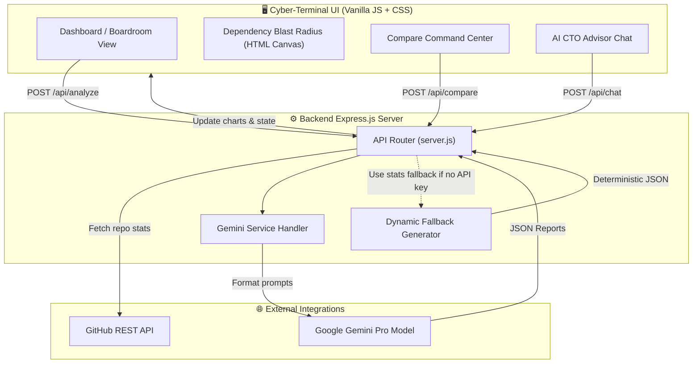

<div align="center">

# 🛡️ TrustGraph

### AI-Powered Open Source Adoption Intelligence Platform

*Know before you build.*

[](https://opensource.org/licenses/MIT)
[](https://nodejs.org/)
[](https://expressjs.com/)
[](https://www.w3.org/Style/CSS/)
[](https://developer.mozilla.org/en-US/docs/Web/JavaScript)
[](https://ai.google.dev/)
[](CONTRIBUTING.md)
[](#)

**[Live Dashboard](http://localhost:3000)** · **[Report Bug](../../issues)** · **[Request Feature](../../issues)**

</div>

---

## 📖 Table of Contents

- [Positioning & Vision](#-positioning--vision)
- [The 10 Core Features](#-the-10-core-features)
- [Architecture](#-architecture)
- [Tech Stack](#-tech-stack)
- [Folder Structure](#-folder-structure)
- [Installation Guide](#-installation-guide)
- [Running the Project](#-running-the-project)
- [API Endpoints](#-api-endpoints)
- [License](#-license)

---

## 🎯 Positioning & Vision

**TrustGraph** is not a simple repository scanner. It has been built to be a **Decision Intelligence Platform**. 

Instead of leaving users with simple vanity stats or arbitrary numbers, TrustGraph directly answers the ultimate organizational question:
> **"Should my organization adopt this repository?"**

Inspired by systems like **Bloomberg Terminal, Palantir Foundry, and Datadog**, the application translates raw telemetry from the GitHub API into boardroom recommendations, regulatory verdicts, and interactive risk models.

---

## ✨ The 10 Core Features

1. **Boardroom Decision Card**: Instant adoption stamps (`APPROVED`, `REVIEW REQUIRED`, `RESTRICTED`, `REJECTED`) with a confidence progress index (%) and color-coded neon risk badges.
2. **Adoption Compliance Profiles**: Renders tailored verdicts for 7 organizational settings: **Personal Project, Startup MVP, Internal Enterprise Tool, Production SaaS, Banking, Healthcare, and Government**.
3. **Future Viability Line Chart**: Interactive 24-month viability projection line chart powered by **Chart.js** displaying decay/stability curves.
4. **Repository Comparison Command Center**: Side-by-side tabular comparison matrix comparing stars, forks, contributors, security, maintenance, and documentation. Declares a clear winner with detailed justification.
5. **Dependency Blast Radius canvas simulator**: Interactive HTML Canvas network visualizer mapping dependency hierarchies. Features a **Compromise Simulation** where clicking any node cascades a red warning line back to the root, calculating affected packages and internal systems.
6. **Repository Health Status**: Computes and displays dynamic health badges: `Strong` (Healthy), `Moderate` (Stable), or `Fragile` (Declining/Zombie).
7. **Enterprise Readiness Score**: A single readiness gauge (0-100) reflecting security policies, licenses, active lockfiles, and contributor velocity.
8. **AI Architect Chat Advisor**: Chat interface with preloaded, high-impact CTO questions. Generates context-grounded responses detailing risks and integration advice.
9. **Trust History Timeline**: Vertical, chronological milestone feed mapping historical releases, activity drops, and compliance telemetry.
10. **Top Trusted AI Tools Leaderboard**: Multi-category analytics leaderboard displaying Top MCP Servers, Agent Frameworks, RAG Frameworks, and AI SDKs.

---

## 🏗️ Architecture



---

## 🧰 Tech Stack

* **Frontend**: HTML5, Vanilla JavaScript (ES6+), Vanilla CSS (Custom properties, dark grid layout, neon status indicators), **Chart.js** (CDN).
* **Backend**: **Node.js** with **Express.js** routing.
* **AI Engine**: Google Gemini API via `@google/generative-ai` SDK.
* **Fallback Handler**: High-fidelity dynamic fallback generator mapping GitHub REST API telemetry (stars, contributors, push intervals, lockfile structures, security files) into the target JSON report.
* **Data Sources**: GitHub REST API (Octokit compatibility headers).

---

## 📁 Folder Structure

```
Gen-AI-Hackathon/
├── prompts/
│   ├── trustPrompt.js             # Detailed JSON response prompt for single repo analysis
│   └── comparePrompt.js           # Prompt schema for multi-repo comparisons
├── public/                        # Static assets served by Express
│   ├── app.js                     # Core application logic (tabs, Chart.js rendering, Canvas physics)
│   ├── index.html                 # Cyber-terminal dashboard markup
│   └── style.css                  # Dark mode, grid layout, neon indicator rules
├── services/
│   └── geminiService.js           # Gemini API service bindings and schema controls
├── .env.example                   # Template env file for credentials
├── package.json                   # Project packages & dependencies
├── server.js                      # Express API server setup and endpoint routers
└── README.md                      # Platform documentation (This file)
```

---

## ⚙️ Installation Guide

### Prerequisites
* **Node.js** (v18 or higher recommended)
* A **GitHub Personal Access Token (PAT)** (optional, but highly recommended to bypass API rate limits)
* A **Google Gemini API Key** (optional, fallback system will mock responses based on real GitHub data if key is absent)

### Setup Steps
1. **Clone the repository**:
   ```bash
   git clone https://github.com/CapedCrusader77/Gen-AI-Hackathon.git
   cd Gen-AI-Hackathon
   ```
2. **Install dependencies**:
   ```bash
   npm install
   ```
3. **Configure Environment Variables**:
   Copy the example file to `.env`:
   ```bash
   cp .env.example .env
   ```
   Open the `.env` file and input your credentials:
   ```env
   PORT=3000
   GITHUB_TOKEN=your_github_pat_token
   GEMINI_API_KEY=your_gemini_api_key
   ```

---

## ▶️ Running the Project

To start the local web server:
```bash
npm start
```
The server will boot and output:
```text
TrustGraph is running at http://localhost:3000
```
Open your browser and navigate to **`http://localhost:3000`** to view the application.

---

## 🔄 API Endpoints

### 1. `POST /api/analyze`
Analyzes a single GitHub repository.
* **Body**: `{"url": "owner/repository"}`
* **Response**: Includes scores, repository data, and the `aiReport` object (due diligence risk logs, adoption readiness statuses, forecasts).

### 2. `POST /api/compare`
Compares up to 3 repositories side-by-side.
* **Body**: `{"urls": ["repo1/name", "repo2/name"]}`
* **Response**: A comparison matrix declaring a winner and providing an architectural justification.

### 3. `POST /api/chat`
Answers questions regarding the analyzed repository.
* **Body**: `{"question": "Should I adopt this in healthcare?", "repoData": { ... }}`
* **Response**: High-fidelity architectural and compliance recommendations tailored to the query context.

---

## 📄 License

This project is licensed under the **MIT License**. See the `LICENSE` file for details.