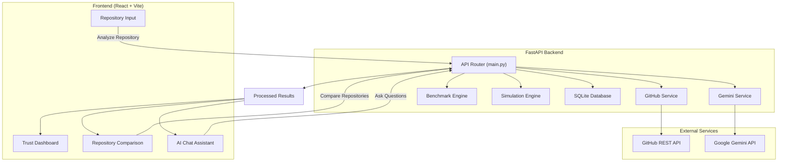
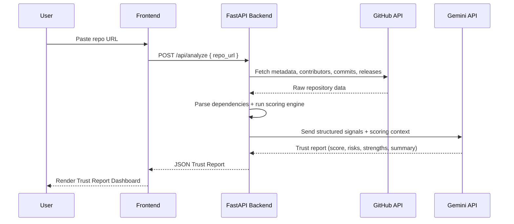

<div align="center">

# 🛡️ TrustGraph

### AI-Powered Open Source Adoption Intelligence Platform

*Know before you build.*

[](https://react.dev/)
[](https://fastapi.tiangolo.com/)
[](https://www.python.org/)
[](https://www.typescriptlang.org/)
[](https://ai.google.dev/)
[](https://cloud.google.com/)
[](https://opensource.org/licenses/MIT)
[](https://vitejs.dev/)
[](https://www.sqlite.org/)


**Gen AI Academy Hackathon 2026 Submission**
</div>

---

## 📖 Table of Contents

- [Positioning & Vision](#-positioning--vision)
- [The 10 Core Features](#-the-10-core-features)
- [Architecture](#-architecture)
- [Tech Stack](#-tech-stack)
- [Folder Structure](#-folder-structure)
- [Installation Guide](#-installation-guide)
- [Running the Project](#-running-the-project)
- [API Endpoints](#-api-endpoints)
- [License](#-license)

---

## 🎯 Positioning & Vision

**TrustGraph** is not a simple repository scanner. It has been built to be a **Decision Intelligence Platform**. 

Instead of leaving users with simple vanity stats or arbitrary numbers, TrustGraph directly answers the ultimate organizational question:
> **"Should my organization adopt this repository?"**

Designed to provide enterprise-grade repository trust intelligence.telemetry from the GitHub API into boardroom recommendations, regulatory verdicts, and interactive risk models.

---

## ✨ The 10 Core Features

1. **Boardroom Decision Card**: Instant adoption stamps (`APPROVED`, `REVIEW REQUIRED`, `RESTRICTED`, `REJECTED`) with a confidence progress index (%) and color-coded neon risk badges.
2. **Adoption Compliance Profiles**: Renders tailored verdicts for 7 organizational settings: **Personal Project, Startup MVP, Internal Enterprise Tool, Production SaaS, Banking, Healthcare, and Government**.
3. **Future Viability Line Chart**: Interactive 24-month viability projection line chart powered by **Chart.js** displaying decay/stability curves.
4. **Repository Comparison Command Center**: Side-by-side tabular comparison matrix comparing stars, forks, contributors, security, maintenance, and documentation. Declares a clear winner with detailed justification.
5. **Dependency Blast Radius canvas simulator**: Interactive HTML Canvas network visualizer mapping dependency hierarchies. Features a **Compromise Simulation** where clicking any node cascades a red warning line back to the root, calculating affected packages and internal systems.
6. **Repository Health Status**: Computes and displays dynamic health badges: `Strong` (Healthy), `Moderate` (Stable), or `Fragile` (Declining/Zombie).
7. **Enterprise Readiness Score**: A single readiness gauge (0-100) reflecting security policies, licenses, active lockfiles, and contributor velocity.
8. **AI Architect Chat Advisor**: Chat interface with preloaded, high-impact CTO questions. Generates context-grounded responses detailing risks and integration advice.
9. **Trust History Timeline**: Vertical, chronological milestone feed mapping historical releases, activity drops, and compliance telemetry.
10. **Top Trusted AI Tools Leaderboard**: Multi-category analytics leaderboard displaying Top MCP Servers, Agent Frameworks, RAG Frameworks, and AI SDKs.

---

## 🏗️ Architecture



---

## 🧰 Tech Stack

* **Frontend**: React.js, Vite, TypeScript, Tailwind CSS
* **Backend**: Python, FastAPI
* **AI Engine**: Google Gemini 2.5 Flash API
* **Database**: SQLite
* **Data Sources**: GitHub REST API
* **Deployment**: Vercel (Frontend)
* **AI Processing**: Repository telemetry is analyzed using Google Gemini to generate trust reports, repository comparisons, and contextual AI chat responses.

---

## 📁 Folder Structure

```
Gen-AI-Hackathon/
├── backend/
│   ├── services/
│   │   ├── benchmark_service.py      # Repository benchmark analysis
│   │   ├── gemini_service.py         # Gemini AI integration & report generation
│   │   ├── github_service.py         # GitHub API telemetry collection
│   │   └── simulation_service.py     # Trust score simulation engine
│   ├── tests/                        # Backend test cases
│   ├── config.py                     # Environment configuration
│   ├── database.py                   # SQLite database operations
│   ├── main.py                       # FastAPI application entry point
│   ├── requirements.txt              # Python dependencies
│   └── trustgraph.db                 # SQLite database
│
├── frontend/
│   ├── public/                       # Static assets
│   ├── src/                          # React application source
│   ├── package.json                  # Frontend dependencies
│   ├── vite.config.ts                # Vite configuration
│   └── tsconfig.json                 # TypeScript configuration
├── package.json                      # Root project configuration
│
├── .agents/                          # AI agent configuration
├── .env.example                      # Environment variables template
├── .gitignore
├── LICENSE
└── README.md 
```

---

## ⚙️ Installation Guide

### Prerequisites
* **Node.js** (v18 or higher recommended)
* A **GitHub Personal Access Token (PAT)** (optional, but highly recommended to bypass API rate limits)
* A **Google Gemini API Key** (optional, fallback system will mock responses based on real GitHub data if key is absent)

### Setup Steps
1. **Clone the repository**:
   ```bash
   git clone https://github.com/CapedCrusader77/Gen-AI-Hackathon.git
   cd Gen-AI-Hackathon
   ```
2. **Backend setup**:
   ```bash
   cd backend
   python -m venv venv
   source venv/bin/activate        # Windows: venv\Scripts\activate
   pip install -r requirements.txt
   cp ../.env.example .env         # then fill in GITHUB_TOKEN and GEMINI_API_KEY
   ```
3. **Frontend setup**:
   ```
   cd ../frontend
   npm install
   cp .env.example .env.local      # set VITE_API_BASE_URL
   ```
4. **Install dependencies**:
   ```bash
   npm install
   ```
5. **Configure Environment Variables**:
   Copy the example file to `.env`:
   ```bash
   
   ```
   Open the `.env` file and input your credentials:
   ```env
   PORT=3000
   GITHUB_TOKEN=your_github_pat_token
   GEMINI_API_KEY=your_gemini_api_key
   ```

---

## ▶️ Running the Project

To start the local web server:
```bash
npm start
```
The server will boot and output:
```text
Application starts successfully.
```
Open the application in your browser.

---

## 🔄 API Endpoints

### 1. `POST /api/analyze`
Analyzes a single GitHub repository.
* Input:
GitHub Repository URL
* **Response**: Includes scores, repository data, and the `aiReport` object (due diligence risk logs, adoption readiness statuses, forecasts).

### 2. `POST /api/compare`
Compares up to 3 repositories side-by-side.
* Input:
GitHub Repository URL
* **Response**: A comparison matrix declaring a winner and providing an architectural justification.

### 3. `POST /api/chat`
Answers questions regarding the analyzed repository.
* **Body**: `{"question": "Should I adopt this in healthcare?", "repoData": { ... }}`
* **Response**: High-fidelity architectural and compliance recommendations tailored to the query context.

---
## 🔄 API Workflow


---

## 🚀 Future Scope

- 🔮 **Future Risk Prediction** — forecast repo health trajectory using historical activity trends
- 😖 **Repository Regret Score** — quantify likely long-term maintenance pain of adopting a dependency
- 📊 **BigQuery Analytics Dashboard** — aggregate trust trends across analyzed repos
- ⚡ **NVIDIA RAPIDS Acceleration** — GPU-accelerated scoring for large-scale batch analysis
- 📈 **Looker Dashboard** — executive-level visualization of ecosystem trust data
- 💬 **AI Chat Assistant** — expanded conversational assistant across multiple repos at once

---

## 📄 License

This project is licensed under the **MIT License**. See the `LICENSE` file for details.